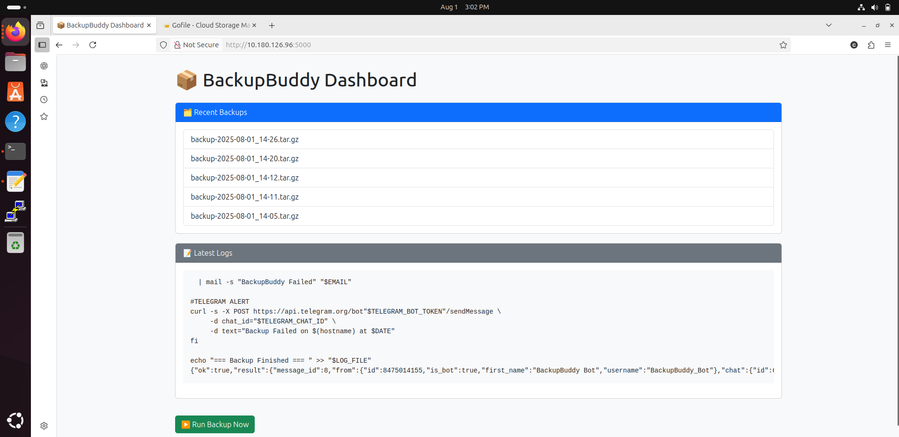
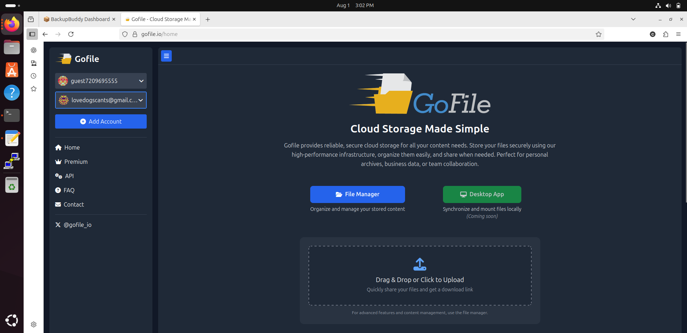
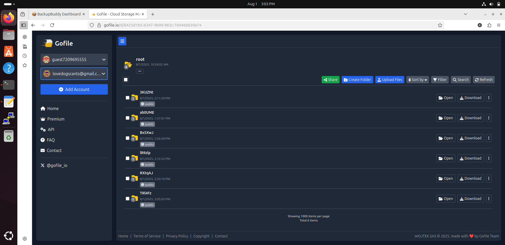
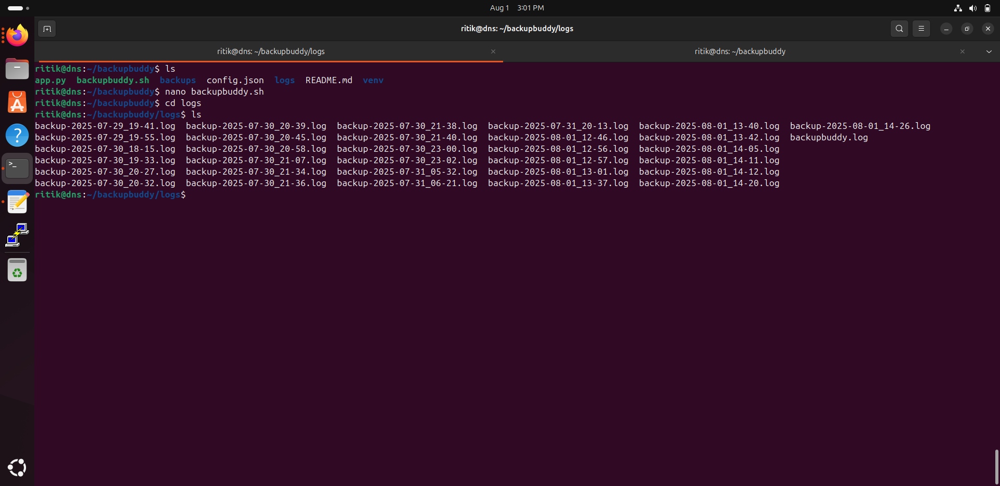
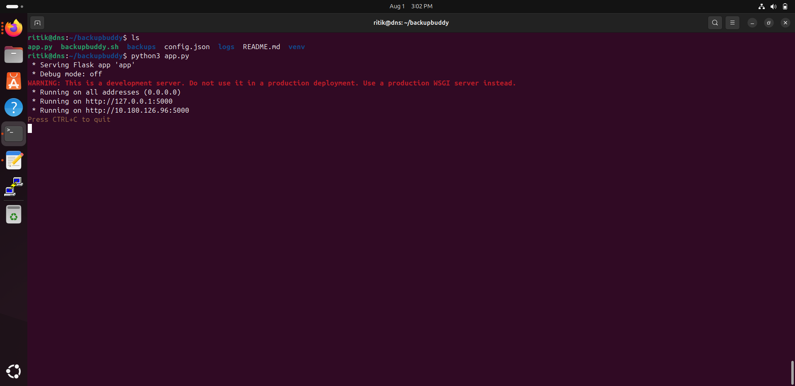
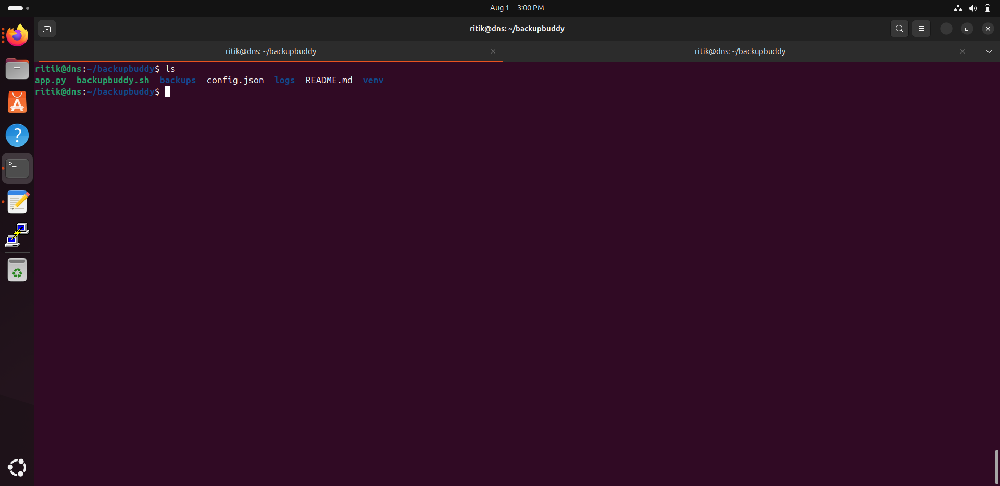
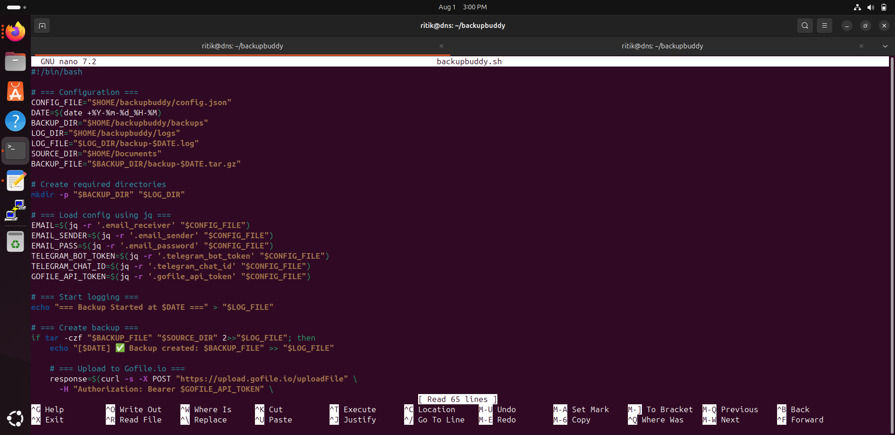
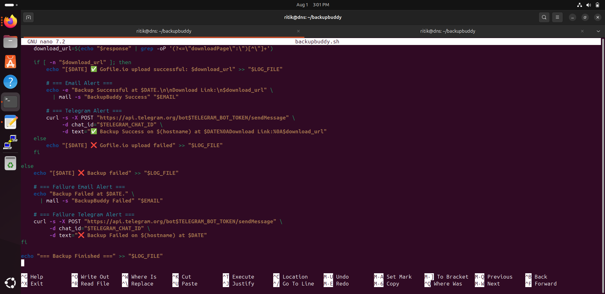

# 🚀 BackupBuddy v2.0

An advanced automated backup tool built for system reliability and DevOps use-cases.  
Now with:

- 📁 Directory compression & secure backups
- ☁️ Upload to [Gofile.io](https://gofile.io/)
- ✉️ Email alerts (Gmail SMTP)
- 📲 Telegram bot notifications
- 🌐 Flask-based dashboard to monitor backups
- 🕒 Cron integration for auto-scheduled jobs

---

## 📌 Features

- 🔒 Secure backup compression (`.tar.gz`)
- 🔗 Uploads backup to Gofile.io and sends the shareable link via Email and Telegram
- 📊 Flask dashboard to view:
  - Gofile upload links
  - Backup logs
  - Status messages
- 💬 Alerts via:
  - Telegram Bot
  - Gmail (SMTP with App Password)
- 🔁 Cron job integration for auto-running backups

---

## 🧱 Project Structure

backupbuddy/
├── backups/ # Backup archive output folder
├── app.py # Flask app entry point
├── backupbuddy.sh # Main shell script
├── config.json # Stores tokens, email, Telegram config
├── logs/ # Contains backup logs
├── venv/ # Python virtual environment
├── README.md # Project README
├── *.png # Screenshots for documentation


---

## ⚙️ Setup Instructions

### 1. Clone the repo

```bash
git clone https://github.com/RitikKTech/BackupBuddy-v2.0.git
cd BackupBuddy-v2.0

2. Make the script executable

chmod +x backupbuddy.sh

3. Configure Email, Telegram & Gofile

Edit config.json and fill in

{
  "email": "your-email@gmail.com",
  "app_password": "your-gmail-app-password",
  "telegram_bot_token": "your-telegram-bot-token",
  "telegram_chat_id": "your-chat-id",
  "gofile_token": "your-gofile-api-token"
}


4. Run the script manual

./backupbuddy.sh

5. (Optional) Setup Cron job

Run crontab -e and add:

*/30 * * * * /home/user/backupbuddy/backupbuddy.sh >> /home/user/backupbuddy/logs/cron.log 2>&1

6. Flask Dashboard

Start the dashboard:

source venv/bin/activate
python3 app.py

Open in browser: http://localhost:5000

7. Screenshots


















Contribution & License

MIT License — Free to use & modify.

### 💾 Step 2: Save and Push

```bash
git add README.md
git commit -m "Updated README.md for v2.0"
git push
